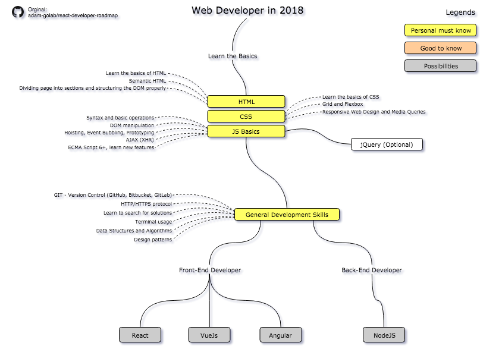

# Euricom JavaScript Training Program

## JavaScript Developer Roadmap

When you are completely new to Web/JavaScript development this is your starting point.

### Info

- [You Don't Know JS (book series)](https://github.com/getify/You-Dont-Know-JS) – Series of books diving deep into JavaScript.
- [Awesome JavaScript](https://github.com/micromata/awesome-javascript-learning)
- [Awesome Web Development ](https://github.com/Stanko/awesome-web-development)

### Basic

- Introduction of Web Development
    - [Introduction to Web Development (FrontEndMasters)](https://frontendmasters.com/courses/web-development/)

- Learn HTML/CSS
    - [How to make your first website](https://www.leveluptutorials.com/tutorials/how-to-make-your-first-website) - Basic Html & CSS
    - [Bootstrap Beginner Crash Course (youtube)](https://www.youtube.com/watch?v=5GcQtLDGXy8)
    - [Bootstrap 3 (PluralSight)](https://app.pluralsight.com/library/courses/bootstrap-3) or [Bootstrap Tutorial for Beginners (youtube)](https://www.youtube.com/watch?v=aTLRdrRQyN4)
    - [CSS Grid](https://cssgrid.io/)
    - [Flexbox Froggy](http://flexboxfroggy.com/) - Fun CSS Flexbox tutorial

- Learn JavaScript
    - [Deep JavaScript Foundations V2 (FrontEndMasters)](https://frontendmasters.com/courses/javascript-foundations/) Or [Advanced JavaScript V1 (PluralSight)](https://app.pluralsight.com/library/courses/advanced-javascript) - Same course different platform
    - [JavaScript - From Fundamentals to Functional JS (FrontEndMasters)](https://frontendmasters.com/courses/js-fundamentals-functional-v2/)
    - [TypeScript Tutorial (youtube)](https://www.youtube.com/watch?v=-PR_XqW9JJU) - Quick Intro

- Learn Font-end Tooling
    - [Building a JavaScript Development Environment](https://app.pluralsight.com/library/courses/javascript-development-environment/table-of-contents)
    - [Practical Git for Everyday Professional Use (EggHead.io)](https://egghead.io/courses/practical-git-for-everyday-professional-use)

### Next Step

JavaScript Front-End Developer

- [React Developer Roadmap](./react-developer-roadmap.md)
- [Angular Developer Roadmap](./angular-developer-roadmap.md)
- [VueJS Developer Roadmap](./vuejs-developer-roadmap.md)

JavaScript Back-end Developer

- [NodeJS Developer Roadmap](./nodejs-developer-roadmap.md)

Make sure you know:

- Html/CSS
    - Basics
    - CSS Grid & Flexbox
    - Bootstrap or other CSS Framework
- JavaScript
    - Lexical Scope & Closures
    - This reference
    - Prototypes
    - Modules Systems: CommonJS & ES Modules
    - Promises
    - ES6+ like destructering, rest operators, arrow functions, classes, ...
- Tooling
    - ESLint, Prettier
    - Npm/yarn
    - Git

### Improve

- Improve JavaScript
    - [FrontEndMasters: Functional-Light JavaScript](https://frontendmasters.com/courses/functional-javascript-v2/)
    - [Jest Crash Course (youtube)](https://www.youtube.com/watch?v=7r4xVDI2vho) - Unit Testing in JavaScript

- Improve VSCode
    + https://www.youtube.com/watch?v=OOG3xcUQY5k

- Improve GIT
    + [Git CheatSheet](http://ndpsoftware.com/git-cheatsheet.html)

### Elective Coursework

- WebPack
- RollUp
- Unit Testing with Mocha / Chai
- JQuery
- Top commertial trainings
    - [ES6 for Everyone (Wes Bos)](https://es6.io/)

