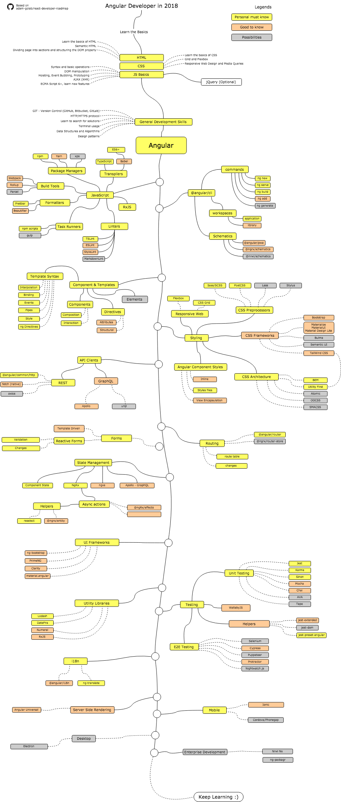

# Euricom Front-End Training Program

## Angular Developer Roadmap

### Info

- [Official Guide](https://angular.io/)
- [Awesome Angular](https://github.com/gdi2290/awesome-angular#official-resources)

### Personal Must Know

- Learn TypeScript
    - [TypeScript Fundamentals (FrontendMasters)](https://frontendmasters.com/courses/typescript/)

- Learn RxJS
    - [RxJS Observables Crash Course (youtube)](https://www.youtube.com/watch?v=ei7FsoXKPl0)
    - [Adding Even More Fun to Functional Programming With RXJS (youtube)](https://www.youtube.com/watch?v=8EExNfm0gt4)

- Learn Angular
    - [Building Awesomer Apps with Angular (FrontEndMasters)](https://frontendmasters.com/courses/building-apps-angular/)

### Starter

- [@angular/cli - CLI tool for Angular](https://github.com/angular/angular-cli)

### Good To Know

- Improve JavaScript/Typescript
    - [Functional-Light JavaScript (FrontEndMasters)](https://frontendmasters.com/courses/functional-javascript-v2/)
    - [TypeScript Fundamentals (FrontEndMasters)](https://frontendmasters.com/courses/typescript/)
    - [TypeScript Masterclass (Ultimate Angular)](https://ultimateangular.com/typescript-masterclass)

- Improve RxJS
    - [RxJS Beyond the Basics: Operators in Depth (egghead.io)](https://egghead.io/courses/rxjs-beyond-the-basics-operators-in-depth)

- Learn NgRx
    - [Build Redux Style Applications with Angular, RxJS, and ngrx/store (egghead.io)](https://egghead.io/courses/build-redux-style-applications-with-angular-rxjs-and-ngrx-store)

### Possibilities

- NodeJS (Express)
- GraphQL
- Electron

### Alternative training (commercial)

- [Angular Ultimate Package](https://ultimateangular.com/)

