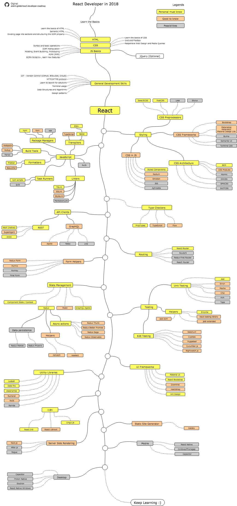

# Euricom Front-End Training Program

## React Developer Roadmap

### Info

- [Official Guide](https://reactjs.org/)
- [Awesome React](https://github.com/enaqx/awesome-react)

### Basic

- [JavaScript - From Fundamentals to Functional JS (FrontEndMasters)](https://frontendmasters.com/courses/js-fundamentals-functional-v2/)
- [Complete Intro to React (FrontEndMasters)](https://frontendmasters.com/courses/react/)

### Starter

- [create-react-app - CLI to create React apps with no build configuration ](https://github.com/facebook/create-react-app)

### Improve

- Improve React
    + [Advanced State Management in React (FrontEndMasters)](https://frontendmasters.com/courses/react-state/)
    + [Advanced React Patterns (FrontEndMasters)](https://frontendmasters.com/courses/advanced-react-patterns/)
    + [Testing React Applications (FrontEndMasters)](https://frontendmasters.com/courses/testing-react/)
    + [Build a Server-rendered ReactJS Application with Next.js (EggHead.io)](https://egghead.io/courses/build-a-server-rendered-reactjs-application-with-next-js) - Next

- Learn CSS in JS
    - Styled-components

- Learn TypeScript
    - [TypeScript Basics](https://app.pluralsight.com/library/courses/typescript/)
    - [TypeScript Fundamentals (FrontEndMasters)](https://frontendmasters.com/courses/typescript/)

- Learn GraphQL
    + [Full-stack GraphQL with Apollo](https://www.leveluptutorials.com/tutorials/full-stack-graphql-with-apollo-meteor-and-react)

### Elective Coursework

- StoryBook for React
- NodeJS (Express)
- GraphQL
- React Native
- Electron
- Gatsby
    - [Build a Blog with React and Markdown using Gatsby](https://egghead.io/courses/build-a-blog-with-react-and-markdown-using-gatsby)
- Top commercial trainings (not for Euricom)
    - [The Complete React Web Developer Course (Udemy)](https://www.udemy.com/react-2nd-edition/?siteID=QZaBth_yPOQ-K6a2lVmepp2tq_4h5HunwQ&LSNPUBID=QZaBth%2FyPOQ)
    - [React For Beginners (Wes Bos)](https://reactforbeginners.com/)

