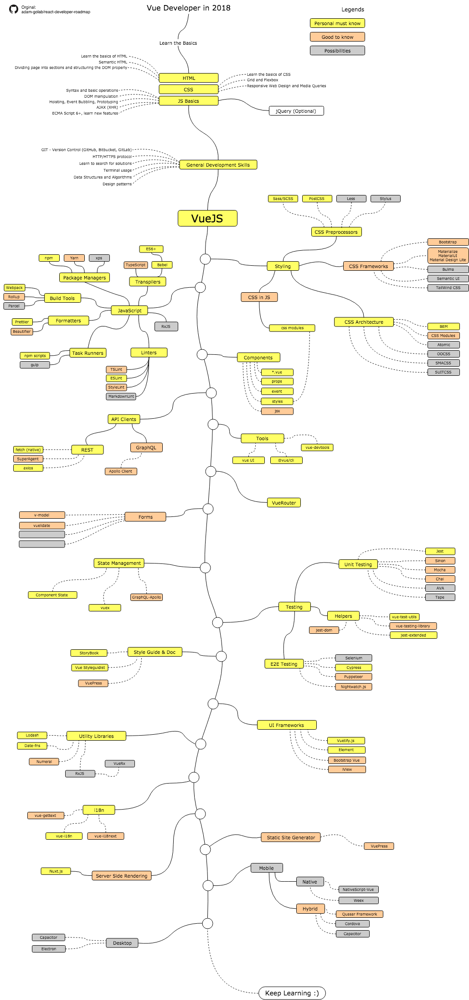

# Euricom Front-End Training Program

## VueJS Developer Roadmap

### Info

- [Official Guide](http://vuejs.org/guide/)
- [StyleGuide](https://vuejs.org/v2/style-guide/)
- [Awesome Vue.js](https://github.com/vuejs/awesome-vue)

### Starter

- [@vue/cli - CLI for rapid Vue.js development](https://github.com/vuejs/vue-cli)

### Personal Must Know

- [Introduction to Vue.js (FrontEndMasters)](https://frontendmasters.com/courses/vue/)

### Good To Know

- Improve VueJS

    + [Unit Testing Vue.js Components with the Official Vue Testing Tools and Jest](https://alexjoverm.github.io/series/Unit-Testing-Vue-js-Components-with-the-Official-Vue-Testing-Tools-and-Jest/)
    + [Advanced Vue.js Features from the Ground Up (FrontEndMasters)](https://frontendmasters.com/courses/advanced-vue/)
    + [Create a News App with Vue.js and Nuxt (EggHead.io)](https://egghead.io/courses/create-a-news-app-with-vue-js-and-nuxt) - Nuxt

- Learn TypeScript
    + [TypeScript Basics](https://app.pluralsight.com/library/courses/typescript/)
    + [TypeScript Fundamentals (FrontEndMasters)](https://frontendmasters.com/courses/typescript/)

### Possibilities

- StoryBook for VueJS
- NodeJS (Express)
- GraphQL
- Electron
- VuePress

### Alternative training (commercial)

- None
